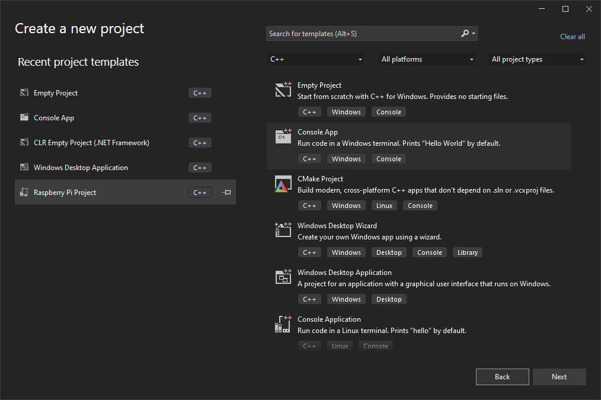
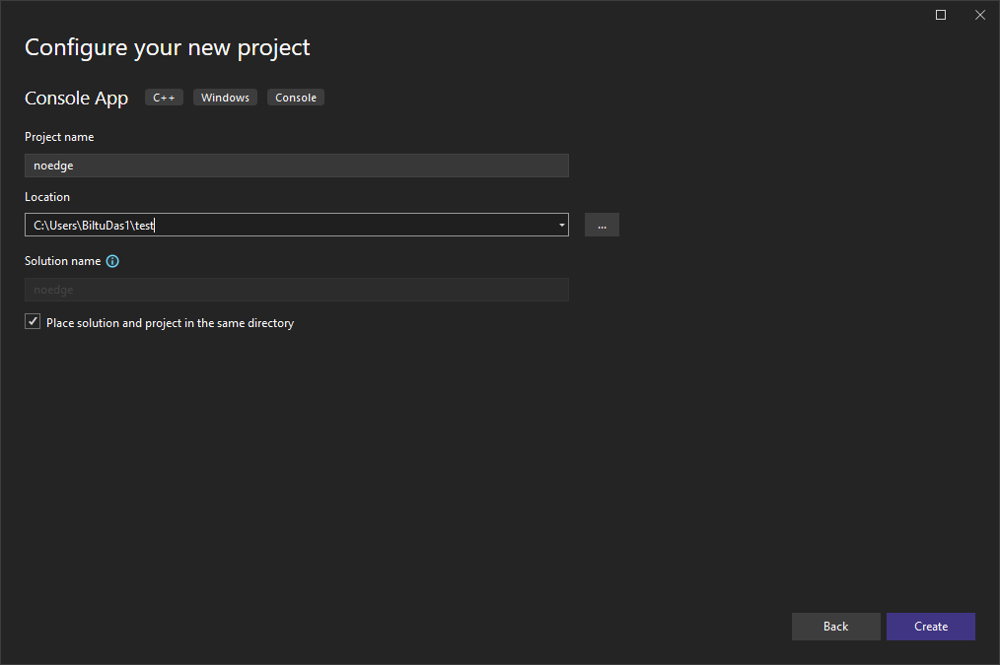
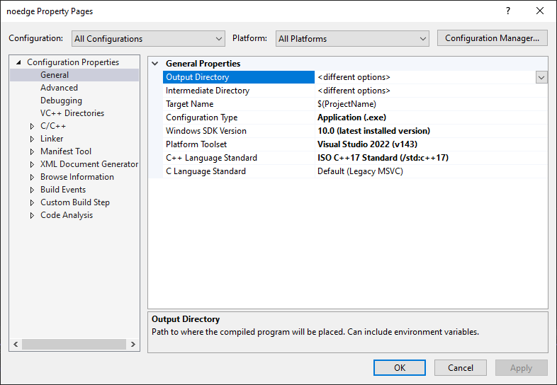

# Creating a Blank Project
* Download the source code in (zip format) and Extract it to a specific directory
* Open Visual Studio and choose ```Create a new Project > Console App``` and press Next



* Now give a Suitable name to the project and choose a location where project files will be located
* Check the checkbox of `Place solution and project in the same directory`



* Now Goto menu `Project > Properities`
* Set Configuration to `All Configuration` and set Platform to `All Platforms`
* then goto `Configuration Properities > General` and change value of `C++ Language Standard` to `ISO C++ 17 Standard (/std:c++17)`
* Now press Ok to save Configuration



* Now Close Visual Studio 2022 and Save Project
